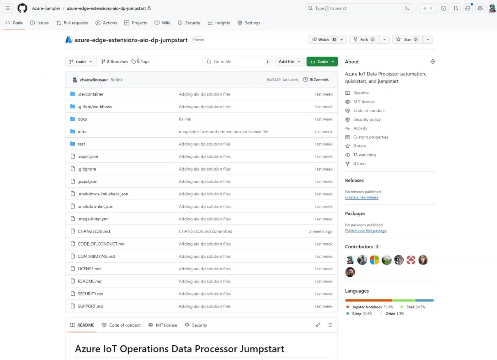

# Azure IoT Operations Data Processor Jumpstart

This repository provides a comprehensive sample implementation of Azure IoT Operations Data Processor pipelines for industrial related scenarios using Machine Status and Total Counter tag enrichments.

The Azure IoT Operations Data Processor is a component of Azure IoT Operations (AIO) designed to handle the complexity and diversity of industrial data. It achieves this by offering data pipelines that enable you to aggregate, enrich, normalize, and filter data from your devices.

When navigating this repository, you will find a rich assortment of pipeline yaml and scripts to enrich and transform a simulated industrial payload.

## Features

This project framework provides the following features:

- AIO Data pipelines to calculate Machine Status and Total Count metrics
- Observability stack that collects metrics and sends them to an OpenTelemetry Collector.
- Validation pipeline that runs e2e tests

You can find a detailed architecture overview in [system architecture document](docs/design/system-architecture.md).

## Getting Started

### Prerequisites

1. A running GitHub Codespace of this repository.
1. Dev container setup with k3d cluster. Upon creation of the Codespace, a k3d cluster "devcluster" is already running and ready to use.
1. **Azure Subscription**: `az login` has been executed and default subscription has been set. Ensure you have access to an Azure subscription where you can deploy resources.

### Quickstart

In order to explore the solution, follow the instructions available in the [Quickstart README.md](./infra/README.md). This will setup the infrastructure with an Arc-enabled K3d cluster and Azure IoT Operations components that support AIO Data Processor pipelines and deploy the AIO Data Processor pipelines.

## Demo

The following video demonstrates the Azure IoT Operations Data Processor Jumpstart in action:

## Resources
- [Azure IoT Operations Preview](https://learn.microsoft.com/en-us/azure/iot-operations/)
- [Azure IoT Data Processor](https://learn.microsoft.com/en-us/azure/iot-operations/process-data/overview-data-processor#what-is-azure-iot-data-processor)
- [OpenTelemetry Collector](https://opentelemetry.io/docs/collector/)