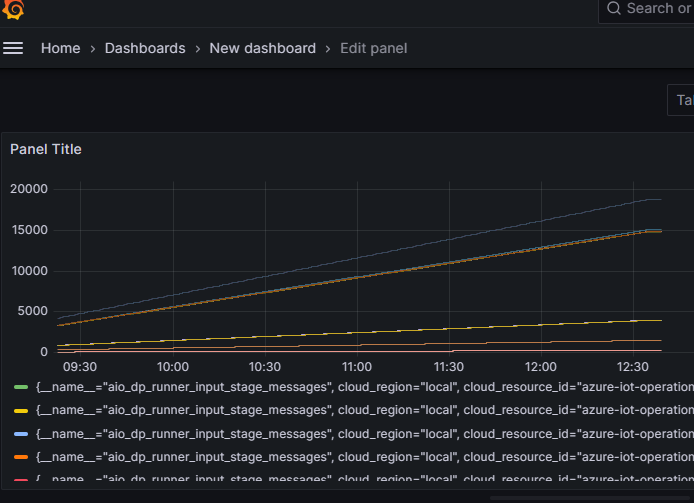
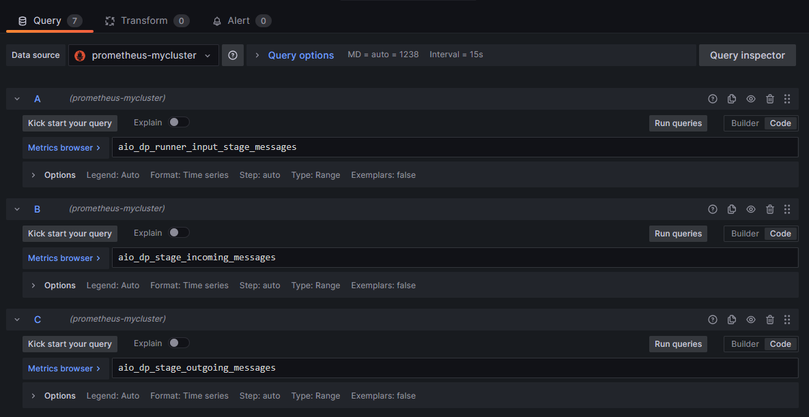

# Introduction to Observability in Azure IoT Operations Stack for Kubernetes in Industrial Scenarios

## Overview

Observability is a critical aspect of managing and optimizing the performance of complex systems, especially in the realm of Industrial Internet of Things (IoT) operations. In the Azure IoT Operations stack, built on Kubernetes, observability plays a pivotal role in gaining insights, monitoring, and troubleshooting to ensure the reliability and efficiency of industrial processes.

## Key Components

The observability stack in Azure IoT Operations leverages Azure Monitor, Grafana, Kubernetes, and Prometheus to provide comprehensive insights into the Kubernetes-based infrastructure. These components work together to collect and analyze data, offering visibility into the performance, traces, and metrics of the deployed applications and underlying infrastructure.

## Getting Started

The observability stack is part of the instructions on the [provisioning scripts](../infra/provisioning/). Follow the [instructions to provision](../infra/provisioning/PROVISIONING.ipynb) the necessary resources.

> Important. The available traces and metrics will depend on the number of AIO components enabled, and the type of insights enabled to be scraped by the Prometheus connector. For example if any of the metrics mentioned here, or dashboards does not show data one of the reasons could be that there is not a fully AIO stack deployed, or that Cluster Insights is not enabled. 
> Using the solution available in this repo is not a fully deployed AIO stack and will therefore not have any metrics available in Prometheus.

## Troubleshooting

### Data Processing

#### Using kubectl logs to find exception traces

A very useful snippet to monitor data processing pipelines is using kubectl with grep/bash:

```bash
kubectl logs aio-dp-runner-worker-0 -n azure-iot-operations | grep "<pipeline name>" | grep -y "Error" | grep "<stage name>" | grep message_process | jq 
```

For example:

```bash
kubectl logs aio-dp-runner-worker-0 -n azure-iot-operations | grep "pipeline-zurich" | grep -y "Error" | grep "data-load" | grep message_process | jq 
```

You could combine this with top, to filter only the last 10, for example:

```bash
kubectl logs aio-dp-runner-worker-0 -n azure-iot-operations | grep "pipeline-zurich" | grep -y "Error" | grep "data-load" | grep message_process | top -n 10 | jq 
```

#### Using Azure Monitor to find exception traces

If the observability stack is correctly setup, all these traces land into the Azure Monitor Logs Workspace where we can use KQL to retrieve them:

```KQL
ContainerLog
| where Type == 'ContainerLog'
| where SourceSystem == 'Containers'
| where LogEntrySource == 'stdout'
| where LogEntry startswith('{"trace_id"')
| where LogEntry contains ('"code.function":"FinalError"')
| where LogEntry contains ('"pipeline.id":"machine-status-from-input"')
```

This could be the base for alerts or monitoring systems.

> Note: Not all LogEntries are json, so, if you want to parse and compare dynamic KQL objects, verify the LogEntry first.

#### Getting started with Grafana

After setting up observability, an Azure Managed Grafana resource will appear in your cluster resource group. This instance is already configured to receive information from two data sources: prometheus (metrics), and Azure Monitor (traces). Use the explore option in each of the data source to see what information is landing.

You could also import existing dashboards [from the samples provided by the product group](https://github.com/Azure/azure-iot-operations/tree/main/samples/grafana-dashboards). There are two versions of each dashboard, both are very similar, use the aio_dp_* ones to monitor data processing.

### Using Grafana dashboards to monitor data ingestion

One simple way to monitor data ingestion is comparing the number of messages across the different parts of the solution.



Use the metrics: `aio_dp_runner_input_stage_messages`, `aio_dp_stage_incoming_messages`, `aio_dp_stage_outgoing_messages`, `aio_dp_reader_incoming_messages`, `aio_dp_reader_processed_messages` to compare messages incoming, and processed in the reader, runner and each stage.

For example, compare if the number of outgoing messages from a data processing pipeline stage is significant lower than the incoming messages on a time frame (ex. 5 minutes). They won't always exactly match, since the stage may take longer than the time frame to process the message, but in average and bigger time frames should be very close.

It is also useful to keep a check and create alerts on `aio_dp_stage_errors`. Combining those two mechanisms will give you a clear picture if any processing pipeline is failing including the data ingestion.

There is also a metric for the number of items in the data store: `aio_dp_refdata_global_store_get_count`. Although we can filter by pipeline in `aio_dp_runner_input_stage_messages`, we cannot directly compare the number of incoming messages in a runner with the refdata store messages, because the data store has a ttl, **and** items can be replaced if they match the same primary key. 
For this to work, it must be a clean environment and we must ensure that all items are unique.



### Using Grafana dashboards for custom metrics

This repository contains examples of how to use Grafana, OTEL Collector and Prometheus to report custom metrics, see [Metrics pipeline](../infra/deployment/PROVISIONING.ipynb#metrics-pipeline) for more information.

The metrics reported will appear as regular metrics in the existing Grafana Prometheus data source. We have included some examples of [dashboards to be imported](../infra/deployment/dashboards/zurich-total-count-and-machine-status.json).