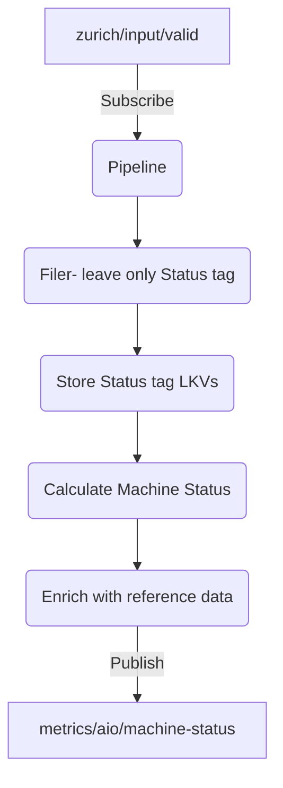

# ADR for Machine Status Calculation

## Overview

This document presents design for implementing the machine status calculation using built-in stages for Azure IoT Operation's data processing pipeline.

### Machine Status logic

Here is the Machine Status calculation logic to be implemented expressed as pseudo-code:

```pseudocode
if Fault==true then return "FAULT"
else if Idle==true then return "IDLE"
else if Mode1==true and Mode2==false then "MODE1"
else if Mode1==false and Mode2==true then "MODE2"
else return "UNDEFINED"
```

### Pipeline Perspective

We consider having one pipeline to calculate machine status with the following steps: 

1. Pull message from `zurich/input/valid` topic.
1. Calculate machine status based on input payload. New payload should just be machine status and nodeid.
1. Enrich machine status with reference data.
1. Output enriched machine status value to a new topic `metrics/aio/machine-status`.


