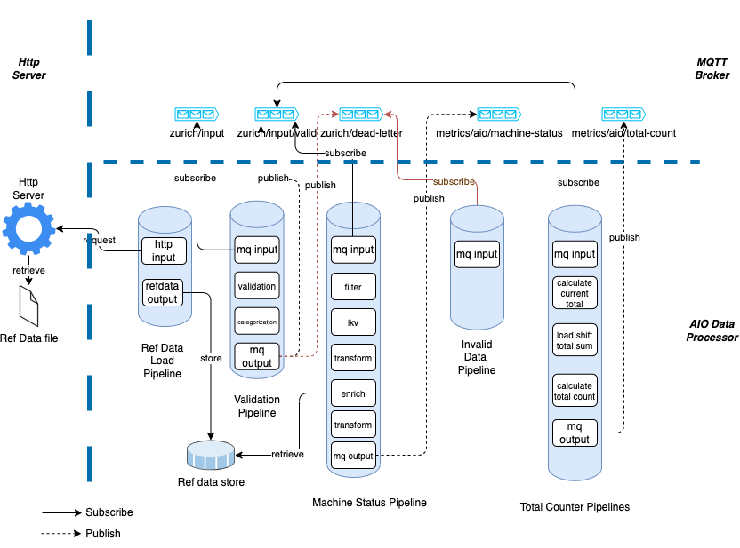

# System Architecture

## Overview

The system architecture diagram above illustrates how our application uses the AIO Data Processing pipelines to conduct investigations. The process begins with the loading of reference data from a file into the AIO reference data store. This data is served by a simple Python HTTP server.

The data then flows through several AIO pipelines for various purposes. The "Ref Data Load Pipeline" loads the data into the reference data store. The "Validation Pipeline" validates the data and determines whether it should be processed further or moved into a "dead-letter" topic for invalid data.

The "Machine Status Pipeline" and "Total Counter Pipeline" perform calculations on the machine outputs. The "Invalid Data Processing Pipeline", which is currently not implemented and out of scope, would process payloads in the dead-letter topic.

The MQTT broker manages several topics, including input, valid, dead-letter, machine-status, and total-counter. These topics represent different stages and types of data in the investigation process.

## Resources

1. **Ref Data file** - This is a [file](../../infra/deployment/http-server-ref/reference-data.json) that will load AIO reference data store.
1. **Http Server** - This is a simple python application deployed.
1. **Ref Data Load Pipeline** - AIO Pipeline for loading data in the reference data store.
1. **Validation Pipeline** - AIO Pipeline used to do Data validation and determine if the payload should be processed further or moved into a deadletter topic.
1. **Machine Status Pipeline** - AIO Pipeline to calculates machine status . You can find design for Machine Status calculation [here](./machine-status.md).
1. **Invalid Data Processing Pipeline** - AIO Pipeline to process payloads in deadletter topic. Not implemented and out-of-scope.
1. **Total Counter Pipeline** - AIO Pipelines to calculate total counter. You can find design for Total Counter calculation [here](./total-count.md).
1. **MQTT Broker** - AIO MQTT broker which holds the following topics:
    - zurich/input - The initial topic that all payloads will be published to
    - zurich/input/valid - Contains all payloads that has been successfully validated
    - zurich/dead-letter - Contains all payloads that has failed validation
    - metrics/aio/machine-status - Contains all successfully processed machine outputs 
    - metrics/aio/total-count - Contains all successfully processed machine outputs 
