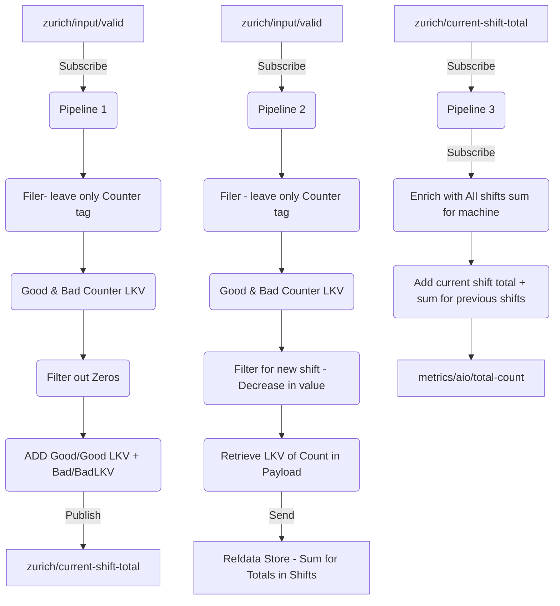

# ADR: Use of Multiple Pipelines for Total Counter Calculation

## Context
Using built-in stages for Azure IoT Operation's data processing pipeline, we want to calculate and display `Total Counter` values while considering the Counters are reset to zero during shift changes. The calculation involves both current shift data and historical shift data.

### Total Count logic

Here is the logic to be implemented expressed as pseudo-code:

```pseudocode
if GoodCounter > PreviousGoodCounter then TotalCounter += GoodCounter - PreviousGoodCounter
if BadCounter > PreviousBadCounter then TotalCounter += BadCounter - PreviousBadCounter
PreviousGoodCounter = GoodCounter
PreviousBadCounter = BadCounter
return TotalCounter
```

where
- GoodCounter: the value is a positive integer that increments continuously after each successfully produced item. GoodCounter is reset to 0 at the end of every shift.
- BadCounter: the value is a positive integer that increments continuously after each unsuccessfully produced item. BadCounter is reset to 0 at the end of every shift.

### Pipeline Perspective

We have decided to use three separate pipelines to handle this process:



Pipeline Descriptions:

1. Pipeline 1: This pipeline is responsible for showing the total counter for the current shift, which includes both BadCounter and GoodCounter counts. When a GoodCounter count is in the payload, it will add that value plus the last known value of BadCounter count, and vice versa. During shift change, both counts with zeros are sent, and this will be filtered out as total count is not affected. 
Although, it does need be after LKV stage, so that it gets set before then.

1. Pipeline 2: This pipeline sends the BadCounter and GoodCounter counts by shifts and stores the data for reference keeping track of sum for all previous shifts per machine. The stage will filter for new shifts which uses the logic of `less than LKV`. At the start of the new shift, it will add either the GoodCounter count from previous shift and BadCounter count from previous shift if any.

1. Pipeline 3: This pipeline is triggered by Pipeline 1. It retrieves the  counter from the current shift and retrieves the sum count from all previous shifts for specific machine from the reference data and adds them up to produce the total count at that moment.

### Assumptions
- BadCounter and GoodCounter Count values only increase or stay the same for the duration of each shift. 
- At least two messages will come during shift change, one with GoodCounter as 0, and one with BadCounter as 0. 
- One payload contains information from only one machine.

### Consequences
- Multiple pipelines requires good management of complexity for environment configurations, testing, troubleshooting and deployments.
- Reference data can get very large. We can possibly solve this by setting TTL and having a separate pipeline that runs before TTL expires in "off-hours" that adds a record total for the day.

### Other Considerations
- The usage of a single pipeline was considered but deemed unfeasible due to limitations with AIO's LKV. The LKV cannot be updated from a calculation; it can only be updated from an input payload value change. The Total Count is calculated based on inputs, hence necessitating the use of multiple pipelines
- The usage of AIO's mqtt state store was considered, but there is no current integration with the pipeline. AIO's mqtt state store can only be interfaced with by publishing and subscribing to the state store's topic.
- The usage of AIO' built in aggregation to manage shifts was considered. The complexity of enabling and disabling pipelines to match current shift times, since only duration is currently supported, was the downside for this implementation.
