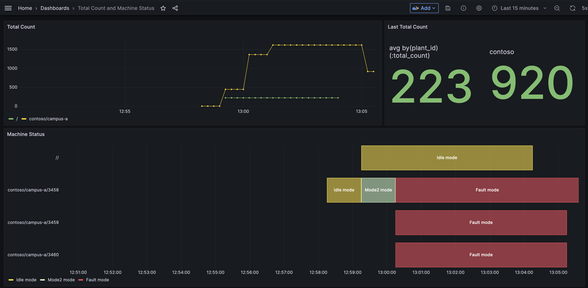

# Quickstart

This is a guide to help you get up and running with the solution for our investigation of Azure IoT Operations (AIO) Data Processing pipelines.

For more detailed information on the deployment of AIO core components follow this [doc](./provisioning/README.md).
For more detailed information on the deployment of AIO pipelines follow this [doc](./deployment/README.md).

## Usage

1. Run deploy script from `infra` directory

```bash
    ./deploy.sh
```

>**Note**: If required, reset your environment using the [00-clean-up.sh](./provisioning/00-clean-up.sh) script, which will delete the k3d cluster and then recreate the cluster with the right image and settings.

For instructions to run individual steps from this script, take a look at the [provisioning](./provisioning/README.md) and [data processor pipeline deployment](./deployment/README.md) documentation.

## Publishing Input Messages

1. Open MQTTUI to watch the data flow through the pipelines:

   ```bash
      mqttui
   ```

1. Publish an input message to the `zurich/input` topic to calculate a machine status, open a new terminal and execute the following command.

   ```bash
      # publish an input to the zurich/input topic to trigger the machine calculation pipeline
      mosquitto_pub -t "zurich/input" -f "../test/data/machine-status-samples/Idle-true.json"
   ```

   You should now see the enriched message with the reference data in the `metrics/aio/machine-status` topic. The machine status value should be `Idle` for the current input.
   To output a different machine status value, you can update the input message accordingly in the `Idle-true.json` file by following the [machine status design](../docs/design/machine-status.md#machine-status-logic).

1. Publish an input message to the `zurich/input` topic to calculate a total counter by executing the following command in a new bash terminal.

   ```bash
      # publish an input to the zurich/input topic to trigger the machine calculation pipeline
      mosquitto_pub -t "zurich/input" -f "../test/data/total-counter-samples/Good-Counter-5.json"
   ```

   You should now see the input message enriched with calculation value for total counter and the reference data in the `metrics/aio/total-count` topic. The total counter value should be 5 for the current input.
   To output a different total counter value, you can send more input message accordingly by following the [total counter design](../docs/design/total-count.md#total-count-logic).

   

## Viewing metrics on Grafana

The deploy script above also creates an Azure Managed Grafana dashboard. At the end of the deployment, click on the provided Grafana link in the output to view total counter and machine status metrics on the `Total Count and Machine Status` dashboard. You can also open the dashboard in a new browser by running this [utils script](./utils/open-dashboard.sh).



## Troubleshooting and debugging

Please see [troubleshooting](../docs/TROUBLESHOOTING.md) and [debugging](../docs/DEBUGGING.md) documents that can help you to navigate through troubleshooting.