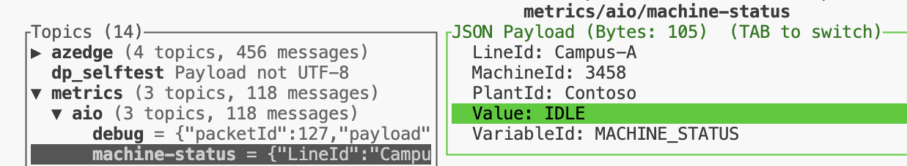
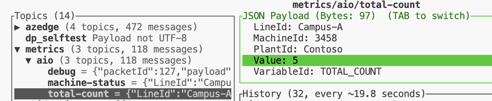
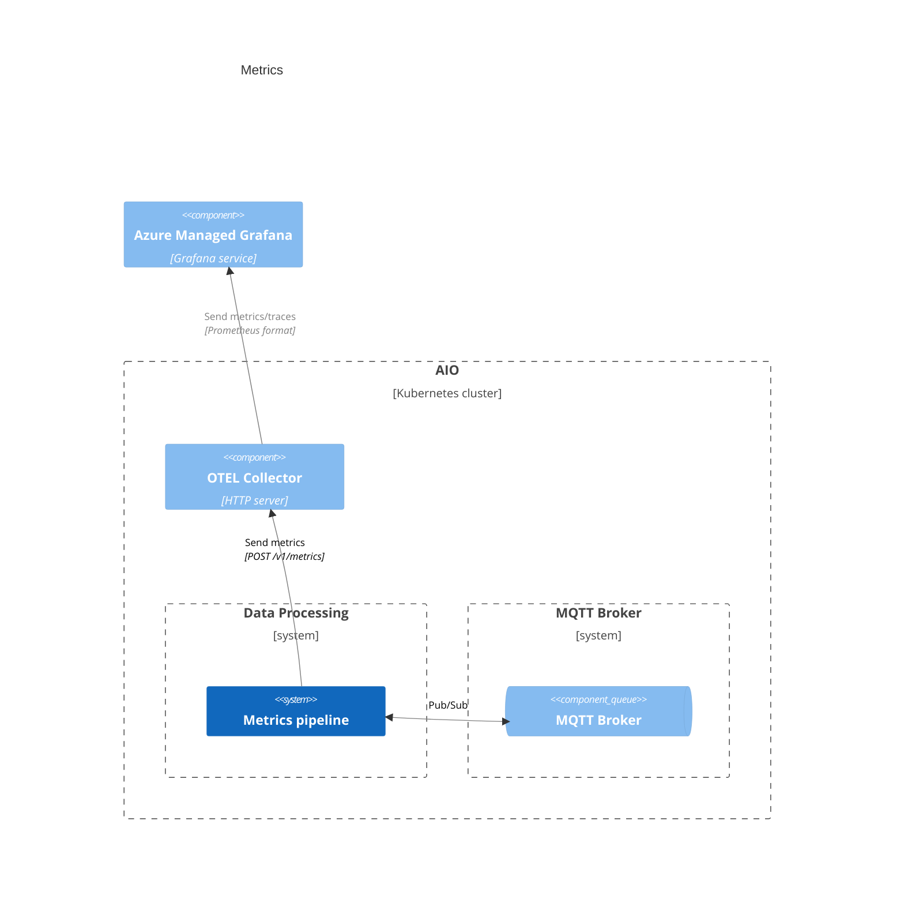
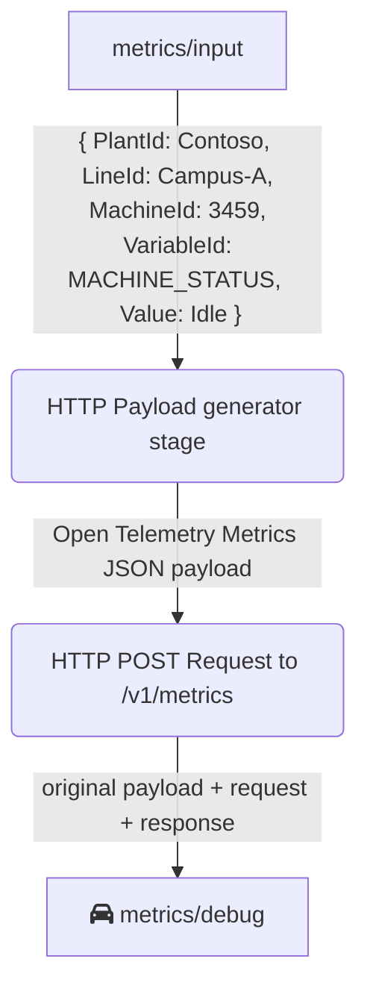

# Deploying Azure IO Data Processor Pipelines with yaml

This README provides guidance on deploying the Azure IO Data Processor Dataset and Pipelines using the provided yaml files.

## Resources created

After following this README the next resources would be created:

1. HTTP Endpoint to Load the Reference Data
1. `dataset-reference-data` Dataset to store reference data
1. Pipeline to get the reference data from the http server and put it in the `dataset-reference-data` Dataset
1. Machine Status Calculation Pipeline
1. `dataset-shift-history-totals` dataset to store totals in shifts
1. Pipeline to calculate current shift total
1. Pipeline to calculate totals in shifts and load data to `dataset-shift-history-totals` Dataset
1. Pipeline to calculate total count

## Prerequisites

Before deploying the Azure IO Data Processor Dataset and Pipeline, ensure you have the following prerequisites:

1. You must have an active Azure subscription. 
   - If you don't have an Azure subscription, you can create a [free account](https://azure.microsoft.com/free/?WT.mc_id=A261C142F) before you begin.
1. An Azure Resource Group where all your resources are deployed
1. An Azure Arc enabled Kubernetes cluster
1. An Azure Data Processor instance
1. An AIO Message Queue (MQ) instance

For steps on manually deploying these, you can find instructions [here](../provisioning/README.md).

## Steps

1. Navigate to the Deployment Folder.

   ```bash
      cd infra/deployment/
   ```

1. Run the following script to deploy http server, datasets, pipeline to load the reference data, machine status calculation pipeline and total counter calculation pipelines:

   ```bash
      ./01-aio-deploy-dp-pipelines.sh
   ```

1. Open MQTTUI to watch the data flow through the pipelines:
   
   ```bash
      mqttui
   ```

1. Publish an input message to the `zurich/input/valid` topic to calculate a machine status, open a new terminal and execute the following command.

   ```bash
      cd infra/deployment/
      # publish an input to the zurich/input/valid topic to trigger the machine calculation pipeline
      mosquitto_pub -t "zurich/input/valid" -f "../../test/data/machine-status-samples/Idle-true.json"
   ```
   
   You should now see the enriched message with the reference data in the `metrics/aio/machine-status` topic. The machine status value should be `Idle` for the current input.
   To output a different machine status value, you can update the input message accordingly by following the [machine status design](../docs/design/machine-status.md#machine-status-logic).

   

1. Publish an input message to the `zurich/input/valid` topic to calculate a total counter, open a new terminal and execute the following command.

   ```bash
      # publish an input to the zurich/input/valid topic to trigger the machine calculation pipeline
      mosquitto_pub -t "zurich/input/valid" -f "../../test/data/total-counter-samples/Good-Counter-5.json"
   ```
   
   You should now see the enriched message with the reference data in the `metrics/aio/total-count` topic. The total counter value should be 5 for the current input.
   To output a different total counter value, you can send more input message accordingly by following the [total counter design](../docs/design/total-count.md#total-count-logic).

   

## Metrics pipeline

The metrics pipeline creates a payload that follows the [OpenTelemetry Protocol (OTLP) Specification](https://github.com/open-telemetry/opentelemetry-proto) to send metrics to an [OpenTelemetry Collector](https://opentelemetry.io/docs/collector/).

This collector is part of the AIO base installation, and you can verify if it is running with:

```bash
kubectl get all -n azure-iot-operations | grep otel-collector
```

> Note: The `aio-otel-collector` and `aio-akri-otel-collector` are different services, we use the `aio-otel-collector` by default.

By default this OTEL collector will send the metrics and traces to a prometheus collector configured in the [Observability guide](../../docs/OBSERVABILITY.md).

The pipeline can listen to multiple topics (as `metrics/aio/machine-status` and `metrics/aio/total-count`), and generate an HTTP Request to the OTEL collector as shown in the following diagram:



A detailed view of the pipeline looks like this:



At the end metrics/debug will contain the original payload, the request and the response for troubleshooting purposes.

## Cleanup

To clean up the deployed resources, use the following script to delete Azure resources and recreate a fresh k3d cluster:

```bash
   ../provisioning/00-clean-up.sh
```

## Standardization

In an effort to maintain consistency across our project, we adhere to the following naming conventions:

- **Pipeline CRDs:** Both the filename and the pipeline metadata name will start with "pipeline-".
- **Dataset CRDs:** Both the filename and the dataset metadata name will start with "dataset-".

By following these conventions, we ensure a uniform structure and make it easier to manage and locate resources within the project.