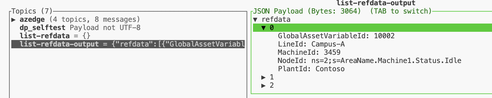
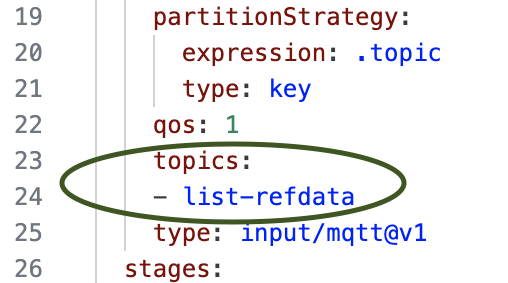
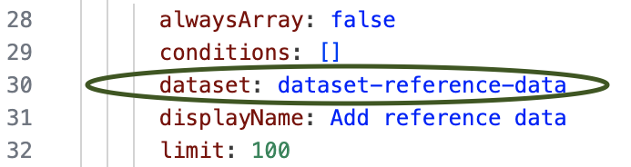
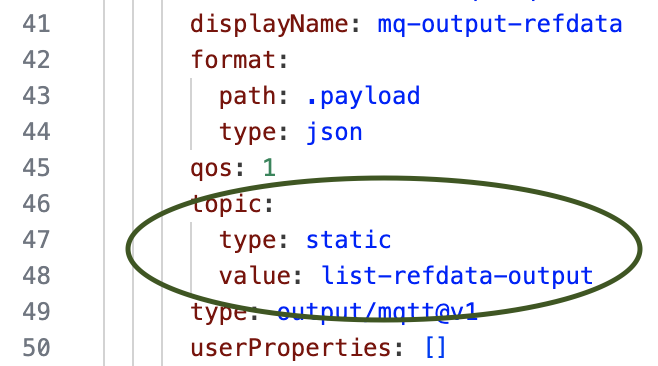

# Debugging pipelines

This folder contains pipelines that can help in debugging AIO Data Processing pipelines and datasets. Please note that these pipelines are being deployed with the core solutions and are ready to be used. After addiing a new pipeline add it to [kustomization file](./kustomization.yaml) before the deployment for it to be included.

## List data in datasets

To be able to see data in datasets supporting pipelines can be developed. This folder provides two debugging pipelines to look into `dataset-reference-data` and `dataset-shift-history-totals` datasets, `pipeline-refdata-list` and `pipeline-shift-history-list` accordingly.

### Usage of existing pipelines

To list data in `dataset-reference-data` dataset follow the next steps:

1. Open MQTTUI to watch the data flow through the pipelines:

    ```bash
        mqttui
    ```

1. Send an empty payload to the `list-refdata` topic, open a new terminal and execute the following command:

   ```bash
      # publish an empty payload to the `list-refdata` topic to trigger the refdata list pipeline
      mosquitto_pub -t list-refdata -m '{}'
   ```

   You should now see the reference data in the `list-refdata-output` topic.

   

### Creation of new pipelines

To create a pipeline to list a data from a new dataset follow the next steps:

1. Make sure you are in `debugging` folder:

    ```bash
    cd infra/deployment/dp-pipelines/debugging
    ```

1. Copy one of the existing pipelines yaml file.

    ```bash
    cp pipeline-refdata-list.yaml pipeline-your-dataset-name-list.yaml
    ```

1. Change the input topic name to a new one:

    

1. Change the dataset name to the one you would like to see data in:

    

1. Change the output topic name to a new one:

    

1. Change all properties that have `name` to your custom names.