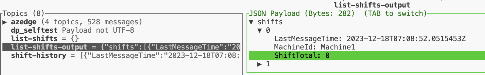
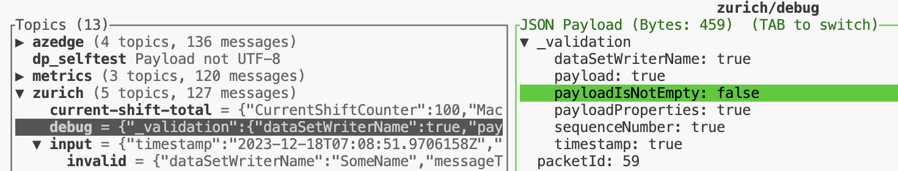

# Debugging pipelines

This folder contains pipelines that can help in debugging AIO Data Processing pipelines and datasets. Please note that these pipelines are being deployed with the core solutions and are ready to be used. 
After adding a new pipeline, add it to [kustomization file](./kustomization.yaml) before the deployment for it to be included.

## List data in datasets

To be able to see data in datasets supporting pipelines can be developed. This folder provides two debugging pipelines and datasets to look into:

- Datasets: 
    - `dataset-reference-data` 
    - `dataset-shift-history-totals`
- Pipelines:
    - `pipeline-refdata-list` 
    - `pipeline-shift-history-list`

### Usage of existing pipelines

To list data in `dataset-reference-data` dataset follow the next steps:

1. Open MQTTUI to watch the data flow through the pipelines:

    ```bash
        mqttui
    ```

1. Send an empty payload to the `list-refdata` topic in a new terminal and execute the following command:

   ```bash
      # publish an empty payload to the "list-refdata" topic to trigger the refdata list pipeline
      mosquitto_pub -t list-refdata -m '{}'
   ```

   You should now see the reference data in the `list-refdata-output` topic.

   

### Creation of a new pipeline

To create a pipeline to list data from a new dataset follow the next steps:

1. Make sure you are in `debugging` folder:

    ```bash
    cd infra/deployment/dp-pipelines/debugging
    ```

1. Copy one of the existing pipelines yaml file.

    ```bash
    cp pipeline-refdata-list.yaml pipeline-<your-dataset-name>-list.yaml
    ```

1. Change the input topic name to a new one:

    

1. Change the dataset name to the one you would like to see data in:

    

1. Change the output topic name to a new one:

    

1. Change all properties that have `name` to your custom names.

## Update records in datasets

To be able to update records in `dataset-shift-history-totals` dataset, the supporting pipeline `pipeline-shift-history-totals-load-manual` was developed. 
Using this pipeline might be helpful to be able to test total counter functionality from scratch, as this pipeline would reset the sum for previous shifts per machine. The pipeline uses the [shift-history-reset file](../../../../test/data/total-counter-samples/shift-history-reset.json) to describe the sum for which machine id will be reset.

### dataset-shift-history-totals pipeline usage

To reset data in `dataset-shift-history-totals` dataset follow the next steps:

1. Open `shift-history-reset.json` file from the current folder and update machine names to the ones you are using:

    ```bash
    code ../../../../test/data/total-counter-samples/shift-history-reset.json
    ```

1. Open MQTTUI to watch the data flow through the pipelines:

    ```bash
        mqttui
    ```

1. Send payload from the `shift-history-reset.json` file to the `shift-history` topic in a new terminal and execute the following command:

   ```bash
        # publish payload from the shift-history-reset.json file to the "shift-history" topic to trigger the shift-history-totals-load-manual pipeline
        mosquitto_pub -t shift-history -f ../../../../test/data/total-counter-samples/shift-history-reset.json
   ```

1. To check that the shifts history was reset successfully run the following command:

    ```bash
    mosquitto_pub -t list-shifts -m '{}'
    ```

    You should now see the shifts history data in the `list-shifts-output` topic.

   

## Data validation

To check the payload for properties validity, `pipeline-zurich-validation-debug` pipeline was created. 
It checks for the following nested properties:

```pseudocode
.sequenceNumber: type == "number",
.dataSetWriterName: type == "string",
.timestamp: type == "string",
.payload: (type == "object" and
            all(.[]; 
                type == "object" and 
                has("SourceTimestamp") and (.SourceTimestamp | type == "string") and 
                has("Value")
            )
            ),
.payloadIsNotEmpty: (.payload != null and (.payload | length > 0)),
.payloadProperties: (.payload | type == "object" and
            all(keys[];
                test("^ns=[0-9]+;s=.*$")
            )
            )
```

### pipeline-zurich-validation-debug pipeline usage

To check the validity of your input payload follow the next steps:

1. Open MQTTUI to watch the data flow through the pipelines:

    ```bash
        mqttui
    ```

1. Send payload to the `zurich/input` topic in a new terminal and execute the following command:

   ```bash
        # publish payload to the "zurich/input" topic to trigger the pipeline-zurich-validation-debug pipeline
        mosquitto_pub -t "zurich/input" -f "../../../../test/integration/assets/zurich-validation/data-validation/invalid/invalid-empty-payload.json"
   ```

   The file `invalid-empty-payload.json` contains the next payload:

   ```json
   {
    "timestamp": "2023-12-18T07:08:51.9706158Z",
    "messageType": "ua-deltaframe",
    "payload": {
    },
    "dataSetWriterName": "SomeName",
    "sequenceNumber": 8001
    }
    ```
    
    You should now see the _validation property in the `zurich/debug` topic that can provide additional insight of why the payload is not valid. In this example we can see `payloadIsNotEmpty = false` which corresponds to the input that was send.

   
