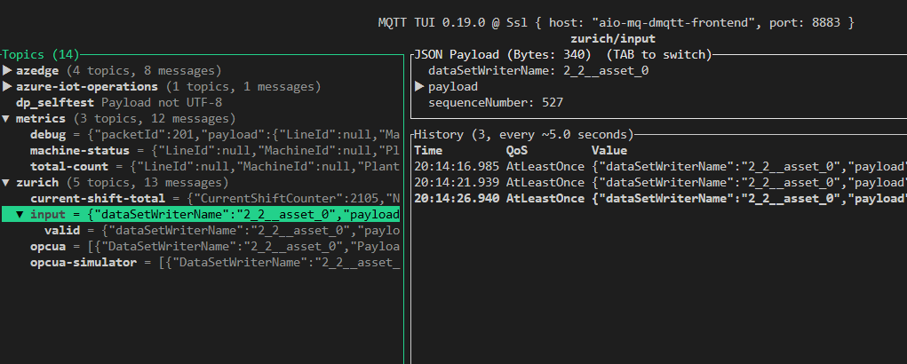

# Provisioning AIO Cluster with K3D

This guide walks you through the steps to provision an Azure IoT Operations (AIO) cluster using the provided Bicep template. The Bicep template is based on the example available in an internal Azure IoT Operations repository.

## Azure Resource Dependencies

1. Azure Key Vault
1. Azure Arc
1. Service Principal

## Prerequisites

1. A running GitHub Codespace of this repository.
1. Dev container setup with k3d cluster. Upon creation of the Codespace, a k3d cluster "devcluster" is already running and ready to use.
1. **Azure Subscription**: `az login` has been executed and default subscription has been set. Ensure you have access to an Azure subscription where you can deploy resources.

If required, reset your environment using the [00-clean-up.sh](./00-clean-up.sh) script, which will delete the k3d cluster and then recreate the cluster with the right image and settings. 

## Steps

### 1. Navigate to the Deployment Folder

```bash
cd infra/provisioning/
```

### 2. Connect to Azure Arc
Set the params as env variables. Ensure that for the parameter `LOCATION` you use one of the [supported regions](https://learn.microsoft.com/en-us/azure/iot-operations/get-started/quickstart-deploy?tabs=linux#connect-a-kubernetes-cluster-to-azure-arc).

```bash
export RESOURCE_GROUP="rg-aio"
export CLUSTER_NAME="mycluster"
export LOCATION="westus2"
```

Run the following script to connect the k3d Kubernetes cluster to Azure Arc.
```bash
./01-arc-connect.sh
```

### 3. Create service principal
Run the script to create a service principal with an app name of your choice.

```bash
./02-create-sp.sh <app-Name>
```

Save the app ID and client secret of the created service principal and set as env variables. These will be in `~/.azure/servicePrincipal.json`. Set the object ID as well.
```bash
cat ~/.azure/servicePrincipal.json
export AKV_SP_CLIENT_ID=<app-ID>
export AKV_SP_CLIENT_SECRET=<client-Secret>
export AKV_SP_OBJECT_ID=$(az ad sp show --id $AKV_SP_CLIENT_ID --query id -o tsv)
```

### 4. Deploy the Bicep Template

Run the following script to provision the Azure Key Vault and deploy AIO with MQ. 

The script automatically sets the Azure Key Vault name based on the Resource Group name you set to `$RESOURCE_GROUP` variable and a random number to prevent name conflicts.
```bash
./03-aio-deploy-core.sh && ./04-aio-deploy-bicep.sh && ./05-aio-deploy-manifests.sh
```

### 5. Verify Deployment

Once the deployment is complete, you can verify the following k8s extensions in your cluster are in the Azure Portal with the status `Succeeded`:

- azure-iot-operations
- mq

### 6. Setup the observability stack (optional)

The observability stack is a set of Azure resources including Azure Monitor, Grafana, and Prometheus connections to the cluster to gather cluster insights, traces and metrics. Run the following script from the provisioning folder:

```bash
./06-observability.sh
```

For more information about using the observability stack, go to [OBSERVABILITY.md](../../docs/OBSERVABILITY.md).

### 7. Testing MQ Broker

1. Open the MQTT UI in a terminal:

   ```bash
   mqttui
   ```

1. Open a new Bash terminal and publish a message.

   ```bash
   mqttui publish "in-cluster-topic" 'hello from within the pod'
   ```

1. Verify you have received the published message in the first terminal you opened the MQTT UI. For that, use the MQTT UI navigation instructions to navigate to the `in-cluster-topic`.

    

### 8. OPCUA Messages Simulator

You can provision the simulator into the system with:

```bash
./08-simulator.sh
```

This will create a pod (data-simulator) that will constantly run and send messages every 5 seconds with the two payloads of Good and MachineStatus.

You can open MQTTUI to visualize all the messages flowing in this order:

1. opcua-simulator
1. opcua
1. input
1. input/valid or input/invalid
1. current-shift-total
1. metrics/aio/machine-status and metrics/aio/total-count

