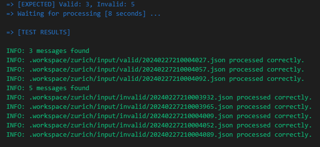
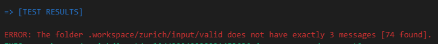
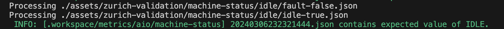
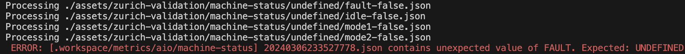
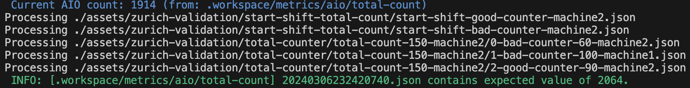
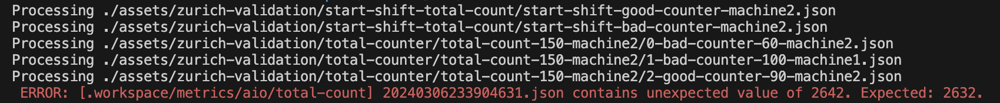
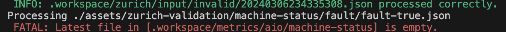

# Integration testing

This guide provides an overview and example implementation of integration testing for the Zurich pipeline and payloads in AIO. It aims to have a example and baseline utils for data validation in the data processing pipelines. 

Integration testing ensures that individual components of a system work together seamlessly. In the context of data processing pipelines, integration testing verifies the end-to-end functionality of the pipeline, including data ingestion, processing, and output generation. It does not test the individual pipelines, but the overall end-to-end implementation.

## Prerequisites 

Ensure the following prerequisites are met:

* jq
* bash
* inotifywait
* mqttclient (mosquitto_pub, mosquitto_sub)
* AIO installed

> **Note:** If you are using GitHub Codespaces jq, bash, mqttclient and inotifywait would be met.

## The Validation Pipelines

In the solution deployment, two validation pipelines are deployed:
- [pipeline-zurich-validation.yaml](../../infra/deployment/dp-pipelines/validation/pipeline-zurich-validation.yaml)
- [pipeline-zurich-validation-debug.yaml](../../infra/deployment/dp-pipelines/debugging/pipeline-zurich-validation-debug.yaml)

## Add Test Messages

Basic test messages are available in `test/integration/assets`. Follow these conventions:

* Prefix files with `invalid-` for invalid payloads and `valid-` for valid payloads.
* Ensure `sequenceNumber` is between 8000-8999 for invalid payloads and 9000-9999 for valid payloads.

Since MQ does not assign unique ids, the `sequenceNumber` helps identify if the message in the output topic is expected to be valid or invalid.

## Adjust the authentication method (optional)

By default, the integration tests use the scripts [`data-feeder/_pub.sh`](./data-feeder/_pub.sh) and [`data-feeder/_sub.sh`](./data-feeder/_sub.sh) to pub/sub from the MQTT Broker.

You can create a `_sub_custom.sh` and `_pub_custom.sh` scripts in your working folder (ex. `test/integration/`) with your specific connection settings. 

For example:

```bash
echo 'mosquitto_sub -q 1 -V mqttv5 -d -h localhost -p 1883 -t $1' > _sub_custom.sh
echo 'mosquitto_pub -q 1 -V mqttv5 -d -h localhost -p 1883 -t $1 -m $2 -i test' > _pub_custom.sh
```

> **Note:** If you have a full AIO deployment, which requires certificates and credentials, there is a commented example of how to use the `mqtt-client` to achieve the connection in [`data-feeder/_pub.sh`](./data-feeder/_pub.sh) and [`data-feeder/_sub.sh`](./data-feeder/_sub.sh).

## Running Tests

To execute the zurich validation integration tests, run:

```bash
cd test/integration
./run-integration-tests.sh
```

> **Note:** If you require specific authentication settings for pub/sub see section `Failed to Connect to Send and Receive Messages into MQ` for guidance.

## Zurich Validation Integration Tests

1. Sets up a temporary folder structure inside `.workspace/`.
1. Watches for any files created in the `.workspace/input` folder and feeds them to the `zurich/input` topic.
1. Watches for messages in topics `zurich/debug`, `zurich/input/invalid`, `zurich/input/valid`,`metrics/aio/machine-status`, `metrics/aio/total-count` storing messages as files under folders of the same respective topic name under `.workspace`.
1. Runs the input validation, total counter validation, and machine status validation tests.
1. Cleans up `.workspace`.

> **Note:** There is also an interactive notebook where you can run through the individual tests called [run-zurich-validation.ipynb](./run-zurich-validation.ipynb). This notebook is a good way to understand the individual tests and how they work.

### Input Data Validation Test

This test marks invalid and valid payloads.

1. Copies files representing messages from the `assets/zurich-validation/data-validation` folder into the `.workspace/input` folder, effectively sending these messages to the `zurich/input` topic.
1. Counts the expected number of invalid and valid files.
1. Waits for the files to be processed in the pipeline.
1. Displays test results.

Example of a `passed` test:



Example of a `failed` test:



### Machine Status Validation Test

This test validates the different scenarios and outputs for the machine status pipeline.

For each scenario:
1. Assigns expected machine status value.
1. Copies files from the `assets/zurich-validation/machine-status` folder into the `.workspace/input` folder to send scenario to the `zurich/input` topic.
1. Waits for the files to be processed in the pipeline.
1. Compares expected and actual.

Example of a `passed` test:



Example of a `failed` test:



### Validate Total Counter

This test validates the total counter pipeline with a couple scenarios such as adding 25, 150, and 250 to the total count.

For each scenario:
1. Indicates shift change by zeroing out good counter and bad counter by sending the files in `assets/zurich-validation/start-shift-total-count` to `.workspace/input` folder to send to the `zurich/input` topic.
1. Adds 1 to total counter.
1. Gets current total counter value.
1. Calculates expected total counter by adding current total counter to what the scenario is expected to add to total counter. 
1. Processes scenario payload in `assets/zurich-validation/total-counter` folder.
1. Waits for the files to be processed in the pipeline.
1. Compares expected and actual.

Example of a `passed` test:



Example of a `failed` test:



## Adding Tests
To add test scenarios for total counter:
1. Create a folder with a series of payload files under `assets/zurich-validation/total-counter`. Make sure to order the payloads with numbers so they get executed in order. See the existing test scenarios for naming guidance.
1. In the `test_for_total_counter` function in `validations/validate-total-counter.sh`, uncomment the following line and update it with your scenario.
```bash
# Add additional scenario here: elif [ "$foldername" == "total-count-x" ]; then expected_count=$((x + current_count));
```

## Troubleshooting

### <a name="mqfail"></a> Failed to Connect to Send and Receive Messages into MQ

If you encounter issues connecting to the AIO MQ broker:

* Verify that the `mosquitto` client is installed and can connect to the AIO MQ broker.
* Check the parameters used for authentication in the `mosquitto_pub` and `mosquitto_sub` calls in the `data-feeder/run-input.sh` and `data-feeder/run-output.sh` scripts. Modify these scripts if the connection requires different parameters.
* Look for more information in the `.workspace/logs` folder.
* If you have the error `cat: .mq-sat: No such file or directory` and/or `Error: Problem setting TLS options: File not found.`, your cluster does not require authentication.

### Debug Recommendations

* Use `mqttui` to monitor topic traffic.
* Before concluding the execution, inspect the messages inside `.workspace/debug`. These messages contain `_validation` and `topic` elements, providing insights into how messages are placed in the respective topics.
* Look for additional information in the `.workspace/logs` folder.

### Messages not arriving to the .workspace outputs folder

* Make sure the MQ connection is working.
* Make sure no other pipelines are running over the same `input` and or `output` topics.

### Extending the integration test

* Make sure the topics names in the pipeline yamls and the `run-zurich-test.sh` match.
* You can add additional verifications of the results in the `check_folder_validity` function.

### Integration test fails because of an empty directory



* Make sure that all the pipelines for AIO are deployed.

    ```bash
    cd /workspaces/aio-evaluation/infra/deployment
    ./01-aio-deploy-dp-pipelines.sh
    ```
### Next steps

* Use kustomize to extend `run-zurich-test.sh` for different pipelines, validations and environments without the need to modify code.
* Replace the wait `sleep` times on `run-zurich-test.sh`, with loop verifications in the `kubectl` logs.
* Add verification of `kubectl logs`, to detect any error.
* Allow to extend or configure the `mosquitto_pub` / `mosquitto_sub` command, to use different authentication/hosts.
* Integrate it to the CI/CD with a GitHub workflow executing it.